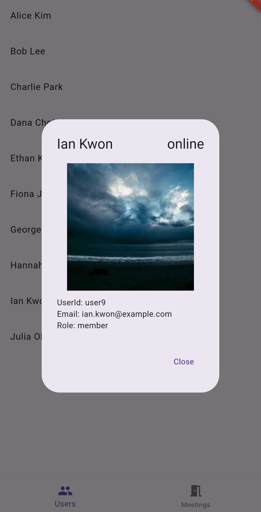
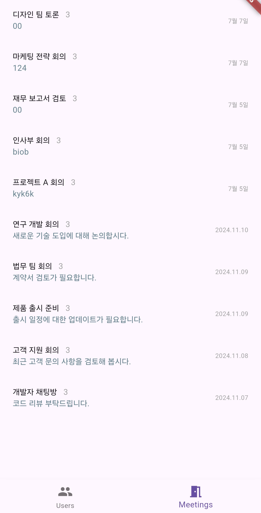
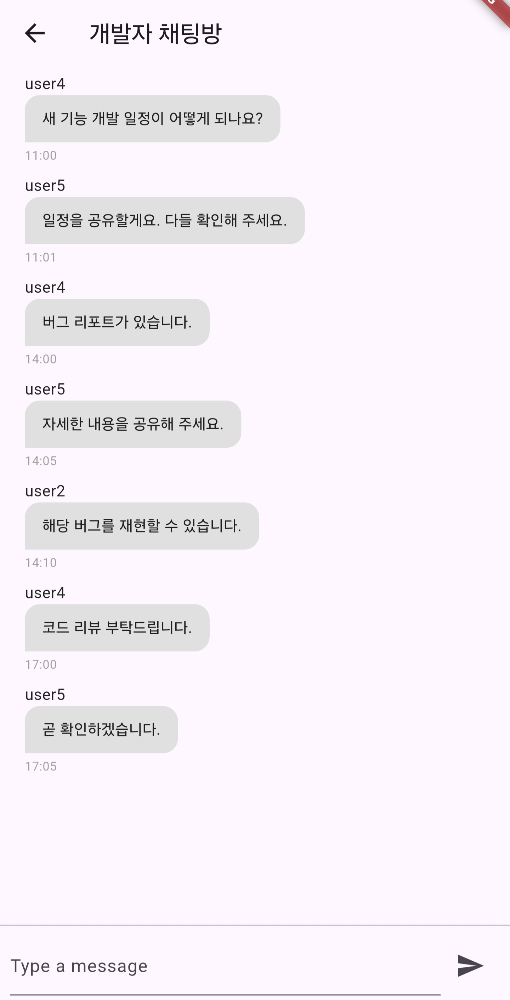

## 🔧 구현 내용 요약

- API 호출 기능 구현
  - Dio + Retrofit 사용
  - Interceptor로 Errorhandling 및 응답 로깅
- Clean Architecture 구조 적용
  - data / domain / presentation / di(provider) 레이어 분리
  - Datasource / Repository 추상화 적용
  - 기능 별 Usecase 분리
- MVVM 패턴 적용
  - 화면 별 ViewModel과 State 구현
- Riverpod 기반 의존성 주입
  - Dio 인스턴스, Datasource, Repository, UseCase, ViewModel 등 DI 구성
- 실패 재시도 로직 적용 (`Future.retryWhen`)
  - exponential backoff(지수 백오프) 방식, 최대 3회 재시도
- 단위 테스트 작성
  - Datasource, Repository, retryWhen, IdGenerator
- CI 작성
  - Analyze & Test
  - Build .aab
  - Build .ipa

---

## 📱 화면 구현 요약
- 앱 실행 시 DB에 데이터가 없다면 API 호출 후 데이터 저장
- 유저 클릭 시 AlertDialog로 상세 정보 노출
- DB에서 채팅방 데이터 불러올 때 lastMessage의 Timestamp 내림차순으로 호출
- 채팅방에서 채팅 전송 시 messageId는 IdGenerator를 이용하여 DB에 저장된 마지막 messageId + 1로 저장

## 📷 스크린샷

  
  
  
  
  

  
